# Digit OCR
Anchor based detection model  
This repository is modified from [ssd.pytorch](https://github.com/amdegroot/ssd.pytorch)  

## Dependency
 - tqdm
 - cv2
 - numpy
 - pandas
 - torch
 - torchvision
 - albumentations

## Dataset
 - MNIST

Validation Samples

    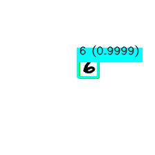  
    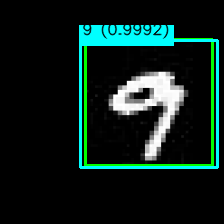   
    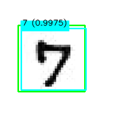  
    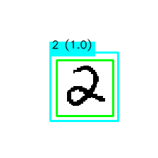  

## Augmentation
### Training
(fixed size of 224x224)
 - random affine
 - random threshold
 - random scaling
 - random noise
 - random erode / dilate
 - color normalization

### Testing
 - pad to square
 - color normalization

## Architecture
 - Resnet18 backbone + FPN neck + SSD head
 - Total number of parameters: 12,149,296 (11,170,240 + 921,216 + 57,840)
 

    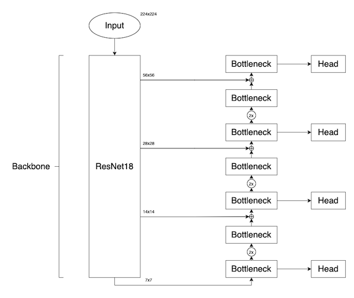   
    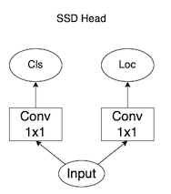  
    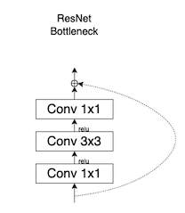  

  
  

## Anchor boxes
 - 4 boxes per feature map pixel
 - Total 16600 boxes (56x56x4 + 28x28x4 + 14x14x4 + 7x7x4) for 224x224 input
  
(See data/config.py)  

    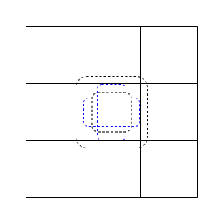  

## Loss Function
 - localization (smooth L1) + confidence (cross entropy) loss
 - Hard negative mining with ratio of 1:3
 - Postive samples: IoU >= 0.5, netural samples: 0.5 > IoU > 0.1

## Post-processing
 - Non maximum suppression (IoU > 0.1, ignore class id)

## Inference Results

    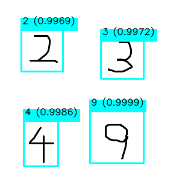   
    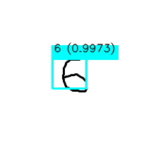   
    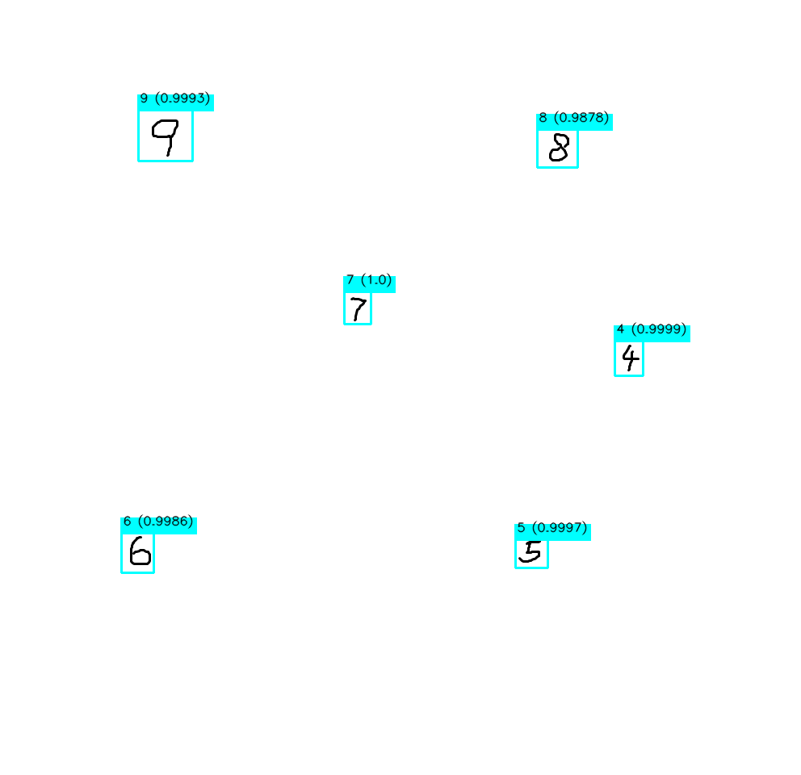   
    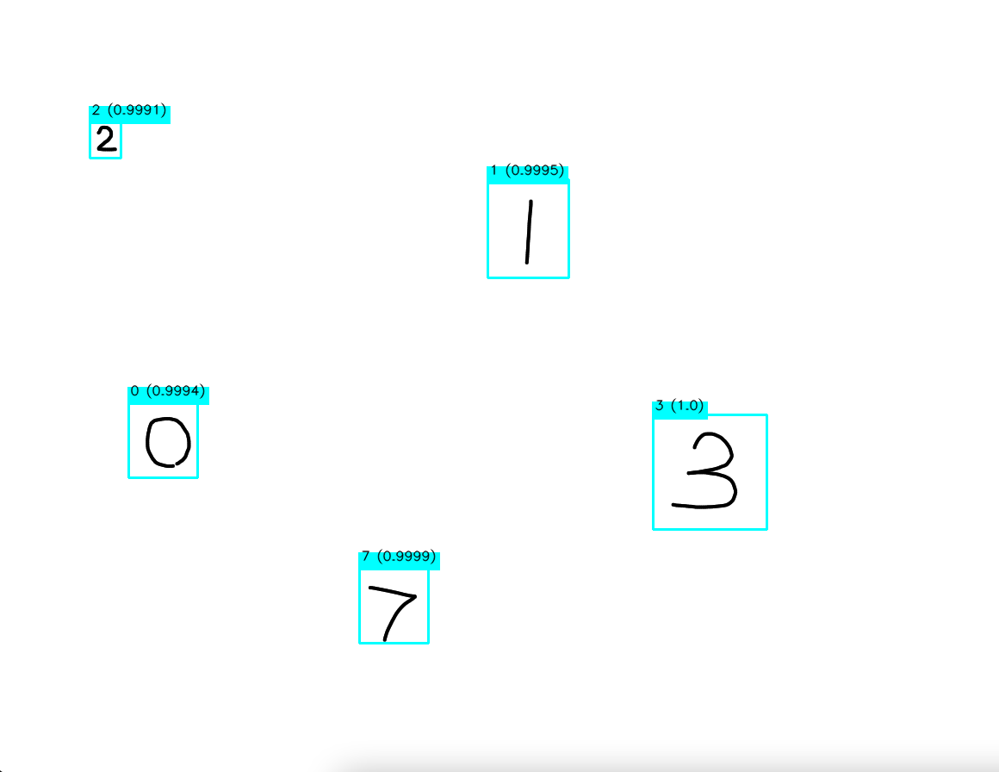   

## Limitations
 1. Only trained on digit size between 28 to 224, will fail if it is too large
 2. Fail if digits are stacked together too closely
 